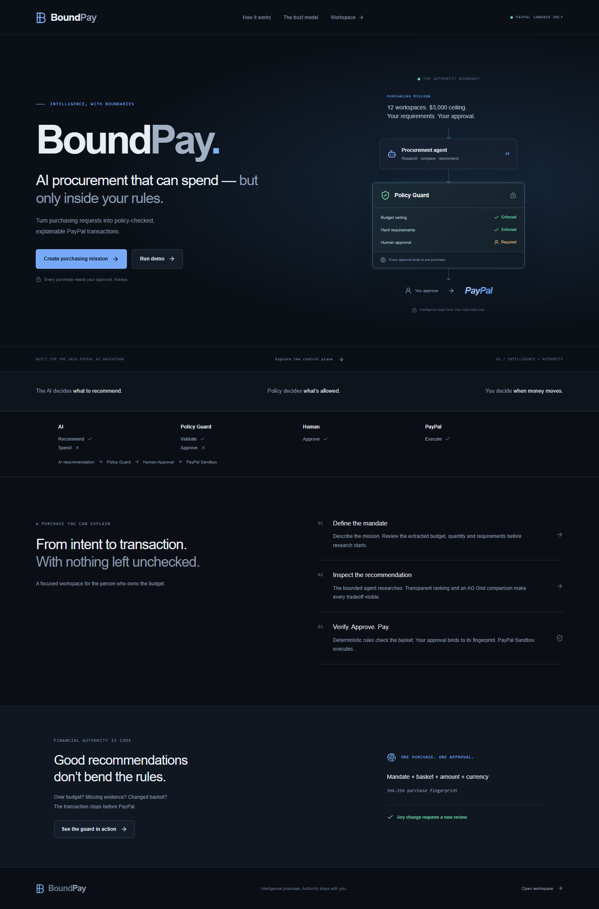
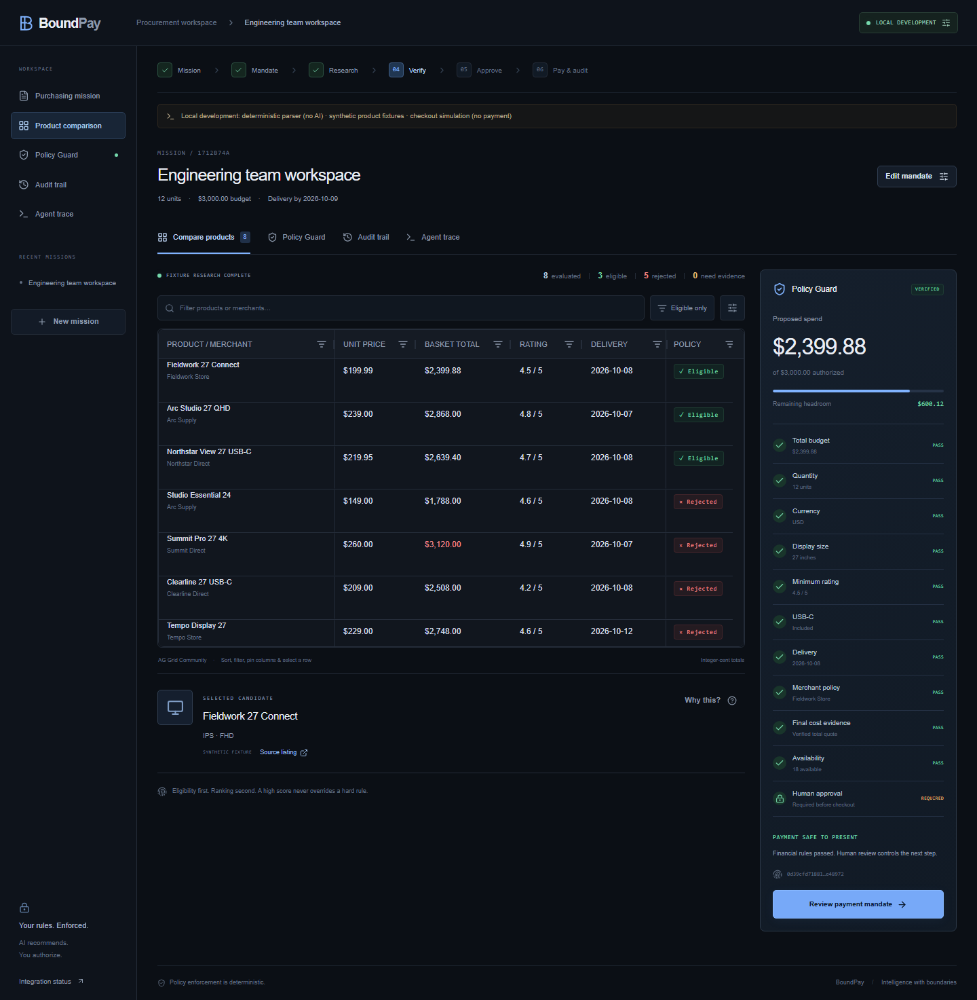
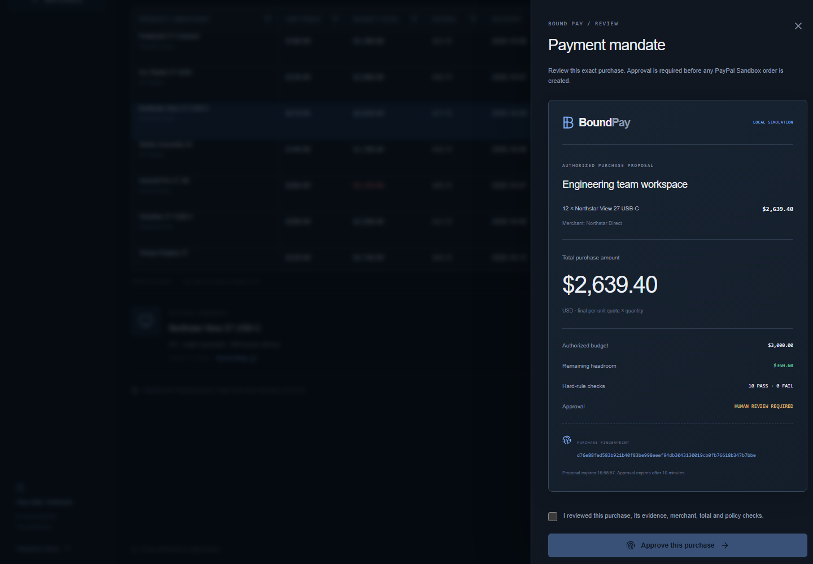

# BoundPay

AI procurement that can spend — but only inside your rules.

**The AI decides what to recommend. Policy decides what's allowed. You decide when money moves.**

[Open BoundPay](https://boundpay.vercel.app) · [Source](https://github.com/ect2000/BoundPay) · [Submission copy](docs/devpost-submission.md) · [Demo script](docs/demo-video-script.md)



## Problem

Small teams need equipment, not another shopping tab. An AI can research a purchase, but a persuasive recommendation cannot be financial authorization. Budgets, evidence, approvals and payment amounts need an independent boundary.

## Solution

BoundPay turns a purchasing request into a reviewed spending mandate, bounded product research, deterministic ranking, a policy-checked basket and a fingerprint-bound human approval. Only then can the server create and capture a PayPal Sandbox order.

## Current demo status

Two deliberate demos are available: [A: live Sandbox catalog subtotal](https://boundpay.vercel.app/mission?demo=1) and [B: fail-closed evidence boundary](https://boundpay.vercel.app/mission?demo=trust). Real OpenRouter extraction and fresh Channel3 research produced 30 candidates and three eligible offers in the public A run. The USD 2,950.68 basket passed all six hard checks; a real USD 3,601.56 alternative was blocked. **Actual human approval, Sandbox buyer approval and capture are completed: order `4ER995653J590745D`, capture `8JG393861X927505V`, exactly USD 2,950.68.** An authenticated PayPal GET confirmed COMPLETED, exact amount and matching mandate fingerprint. Public deployments refuse mocks. [Sanitized payment evidence](docs/live-payment-completed.json) · [Verifiable requirements](docs/demo-scenarios.md) · [Build report](docs/build-report.md).

## Core trust model

```mermaid
flowchart LR
  U[User purchasing mission] --> L[Server OpenRouter / free models]
  L --> D[Zod validated draft]
  D --> R[User reviews mandate]
  R --> A[Bounded procurement agent]
  A --> C[Channel3 product search]
  C --> E[Normalize evidence / unknown facts stay unknown]
  E --> Q[Optional user-reviewed merchant quote]
  E --> B[Eligibility then deterministic ranking]
  Q --> B
  B --> G[Policy Guard]
  G -->|FAIL| X[Payment blocked]
  G -->|PASS| M[Signed payment mandate / SHA-256]
  M --> H[Explicit human approval]
  H --> P[PayPal Sandbox order]
  P --> PA[PayPal buyer approval]
  PA --> V[Recheck signed state + amount + order]
  V --> PC[Sandbox capture]
  PC --> AU[Audit trail / JSON export]
```



## How it works

1. Enter a purchasing request or use structured entry.
2. Review and correct budget, currency, exact quantity, deadline, hard rules, preferences and merchant policy. Approval cannot be disabled.
3. Confirm. The agent plans bounded searches, normalizes results, removes duplicate offers and checks research coverage. Actual completion events stream into the UI.
4. Compare candidates. Every hard rule must pass before weighted ranking applies. Missing evidence fails closed.
5. Inspect the basket and Policy Guard. Choosing an over-budget candidate genuinely prevents payment-capability issuance.
6. Review the payment mandate and explicitly check the review box. Approval binds to the purchase fingerprint.
7. Continue to PayPal Sandbox. The buyer approves on PayPal; BoundPay verifies the order and captures only the approved amount.
8. Inspect the attributed audit trail and export JSON.

## Agent architecture

`LLMProvider` defines intent parsing, next-action planning and recommendation explanation. `ProductProvider` defines search and product detail retrieval. The rest of the app is provider-independent.

The agent has at most 10 steps, 3 searches and 30 unique results by default. Its plan schema permits only `searchProducts` or `finish`. Deterministic tool middleware controls financial operations independently. Search timeouts and free-model retries are finite. A failed tool does not become a made-up result.

Metrics include elapsed time, actual LLM request attempts, Channel3 API calls (searches plus fresh detail reads), evaluated/rejected candidates and rule evaluations. The local deterministic parser records zero LLM calls.

## OpenRouter AI layer

Default primary: **`nvidia/nemotron-3-super-120b-a12b:free`**. Default fallback: **`openrouter/free`**. The model catalog was checked on 3 October 2026. These entries report $0 prompt and completion prices. Gemma was evaluated but its available free endpoint rejected the strict schema parameters; Nemotron successfully parsed the mission and planned real research. This is a suitability decision, not an unsupported claim of universal benchmark superiority.

Model settings are centralized in `src/lib/server/config.ts`. An explicit allowlist rejects every unlisted primary or fallback at server startup with `BoundPay is configured to use a non-free LLM model.` Each OpenRouter provider verifies current zero catalog prices before inference and sends `provider.max_price` of zero. No automatic paid fallback exists. A free model disappearing, changing price, timing out, returning malformed output or lacking strict schema support produces a bounded fallback or an honest error.

All workflow-affecting AI responses use JSON schema and Zod validation. AI may propose requirements or research actions and write explanations. AI never calculates money, authorizes spend, checks approval or enforces policy. The user confirms the parsed draft before it becomes authority.

## Policy Guard and ranking

Money uses integer cents. Decimal strings are converted exactly without floating-point financial calculations. Supported currencies are USD, EUR and GBP, all with two minor-unit digits.

Checks include total and per-unit ceilings, exact quantity, currency, source category, display size, USB-C, rating, custom features, deadline and allow/block merchant rules. The default `verified_purchase` scope also requires verified final cost and exact available quantity. The explicit, human-reviewed `sandbox_catalog` scope authorizes only an exact catalog-subtotal test, with no retail fulfillment. Any additionally requested hard fact must still pass in either scope. Missing evidence is `NEEDS_EVIDENCE`; proved violations are `FAIL`. Both block payment capability issuance. Approval remains required after every hard check passes. Changing scope changes the purchase fingerprint.

Eligible products use a published score:

`30% value + 25% quality + 20% delivery + 15% preferences + 10% merchant`

Value is `max(0, 100 - basketCost / budget * 60)`; quality is rating divided by five, with zero when absent; delivery rewards verified days before the deadline, otherwise 50; preference is the fraction of requested feature preferences matched, otherwise 50; merchant rewards the user's allowlist. These scoring defaults never constitute evidence for a hard requirement. Ties use lower unit price, then product ID. The optimizer selects the highest-ranked eligible uniform basket; mixed baskets are outside this MVP.

## Payment mandate and human approval

The document shows mission, merchant, items, amount, authorized ceiling, remaining headroom, policy checks and the full SHA-256 fingerprint. The fingerprint covers the complete confirmed mandate and basket, including evidence. HMAC-signed, purpose-bound server envelopes prevent client tampering. They expire after 15 minutes; approval/checkout expires after 10 minutes.

The server recomputes policy at approval, order creation and capture. The active fingerprint cookie changes when a different basket is selected and is invalidated when editing, rejecting or restarting. Repeated approval of the same proposal produces a stable order idempotency nonce.

## PayPal integration and agentic commerce

PayPal is the execution boundary, not a decorative payment button. The Sandbox adapter uses server OAuth, Orders v2 `CAPTURE` intent, `payment_source.paypal.experience_context`, a validated Sandbox approval redirect, order-detail verification and capture. `custom_id` carries the purchase fingerprint. Creation and capture use stable `PayPal-Request-Id` headers. An already completed order is retrieved rather than captured again. A `COMPLETED` UI status requires a real completed capture of the exact approved currency and amount.

The agent autonomously researches and proposes a purchase; deterministic policy and human approval govern its transaction. This is the implemented agentic-commerce flow. BoundPay does **not** claim use of PayPal Agent Toolkit, MCP, ACP/UCP, Braintree Agent Ready or merchant-network membership.

**Sandbox settlement goes to your configured test merchant. It does not place an order with the source retailer or fulfill goods. No real-money payment endpoint is supported.**

## AG Grid and Channel3

AG Grid Community powers the desktop comparison workspace: text/number filtering, sorting, resizable/reorderable columns, pinned product/policy columns, click selection, row details, totals, eligibility and conditional failure styling. The selected candidate connects directly to the policy inspector. Mobile uses compact product rows. Recharts visualizes score components in the rationale drawer. AG Studio and Enterprise features are not used.

Channel3 uses the official `@channel3/sdk` 4.x for `/v1/search` and `/v1/products/{id}`. Locale is passed through `config`, with price and merchant filters. Each returned canonical product is freshly retrieved before display; failed refreshes are excluded. Up to 20 detail reads per search run in batches of four within the shared timeout, with SDK retries disabled. The requested `channel3-api` skill is installed locally and informed this integration. Each retailer offer becomes a distinct normalized candidate; prices come from the offer. Product prose never becomes a policy fact. Structured attributes can provide display size/USB-C; unsupported fields remain unknown. A user can review a real merchant quote and explicitly attest final per-unit price including tax/shipping, rating, exact quantity, features and delivery. The audit labels this as **user attestation**, not a provider guarantee. Live search and fresh detail reads were verified with the configured sponsor key; credentials stay in environment variables.

## Security model and prompt injection defense

Provider modules import `server-only`. Keys are never returned to the client, committed or placed in `NEXT_PUBLIC_` variables. Inputs are strict Zod schemas. Request streams have byte limits; external calls have timeouts. Mutations require same-origin JSON and reject cross-site requests. Cookies are HttpOnly, SameSite=Lax and Secure in deployment. Payment redirects allow only `https://www.sandbox.paypal.com`. Captures require the server-signed order link, session, current fingerprint, valid policy and explicit approval.

Product descriptions are untrusted data, separated from agent instructions. Planning receives counts and the confirmed mandate, not arbitrary product instructions. Explanation prompts receive limited product fields. Tests show injected product prose cannot change financial policy or authorize payment. No tool exposed to the LLM can create or capture an order.

This database-free design has meaningful limits: signed capabilities are immutable, short-lived snapshots, not a durable globally revocable authorization service. Browser cookies provide active-context invalidation, not a distributed revocation ledger. The exported browser audit is an operational explanation, not a tamper-proof regulatory ledger. See [architecture and limits](docs/architecture.md).

## Architecture and stack

One Next.js 16.3.8 App Router deployment, React 19.3, TypeScript, Tailwind CSS 4, shadcn-style composable button primitives, Radix Dialog, Motion for React, Lucide, React Hook Form, Zod, AG Grid Community and Recharts. Heavy grid/chart modules are dynamically imported. System typography avoids external font requests. No database, accounts, login, admin console or separate backend.

## Screenshots




[Screenshot provenance](docs/screenshots/README.md) distinguishes local fixtures from real production research, budget rejection and the payment mandate. A local simulated checkout is never evidence of a real Sandbox capture.

## Run locally

Requires Node.js 22+ (tested on 24.13.1) and npm.

```bash
npm ci
npm run dev
```

Open `http://localhost:3000`. Without credentials, development defaults to clearly labeled local modes. For live integrations, copy `.env.example` to `.env.local`, enter credentials locally, and restart. Keep `APP_URL` equal to the exact browser origin, including port; it is used for CSRF and PayPal returns.

## Environment variables

| Variable                                                         | Purpose                                                               |
| ---------------------------------------------------------------- | --------------------------------------------------------------------- |
| `OPENROUTER_API_KEY`                                             | Server-only free-model inference                                      |
| `LLM_MODEL`, `LLM_FALLBACK_MODEL`                                | Explicit allowlisted free models                                      |
| `LLM_MODE`                                                       | `openrouter` or local-only `mock`                                     |
| `CHANNEL3_API_KEY`, `PRODUCT_PROVIDER`                           | Real Channel3 / local-only fixture catalog                            |
| `PAYPAL_CLIENT_ID`, `PAYPAL_CLIENT_SECRET`                       | Sandbox REST application credentials                                  |
| `PAYPAL_MODE`                                                    | `sandbox` or local-only `mock`; no live mode                          |
| `BOUND_PAY_STATE_SECRET`                                         | At least 32 random characters; required for deployed signed workflows |
| `APP_URL`                                                        | Canonical browser origin and Sandbox return origin                    |
| `LLM_MAX_RETRIES`, `LLM_TIMEOUT_MS`, `TOOL_TIMEOUT_MS`           | Bounded retries and requests                                          |
| `MAX_AGENT_STEPS`, `MAX_PRODUCT_SEARCHES`, `MAX_PRODUCT_RESULTS` | Bounded research limits                                               |

[Credential setup](docs/credentials.md) gives exact official pages and local/Vercel steps. **Never paste keys into a chat or commit them.** Public deployments refuse mock modes. `BOUNDPAY_LOCAL_TEST=1` permits an explicit local production test build only when not running on Vercel.

## Testing

```bash
npm run lint
npm run typecheck
npm test
npx playwright install chromium
npm run test:e2e
npm run build
```

74 unit/adapter tests cover money, schema normalization, free-model rejection, both authorization scopes, missing evidence, scope-bound approval, policy failures, injection separation, signed state, agent limits and PayPal creation/capture/idempotency. Four browser tests cover the local journey, both demos, the exact USD 3,120 budget block and restore action, responsive layouts at 1024/390px, keyboard review, forged policy, stale approval and missing capture authority. They capture the local screenshot pack at 1440px. Test transport holds research solely to capture the actual pending UI; production has no artificial processing delay.

Real AI extraction/planning, fresh Channel3 research, human approval, PayPal buyer approval and exact completed Sandbox capture have been verified separately from fixture browser tests. [Payment evidence](docs/live-payment-completed.json) and live screenshots contain no credentials. The [verification checklist](docs/credentials.md) supports repeating the workflow. Runtime dependency audit previously reported no vulnerabilities; the current Next ESLint toolchain has a transitive `braces` development advisory without a compatible upstream fix.

## Deployment

```bash
npm run build
vercel link --project boundpay
vercel env add OPENROUTER_API_KEY production
vercel env add CHANNEL3_API_KEY production
vercel env add PAYPAL_CLIENT_ID production
vercel env add PAYPAL_CLIENT_SECRET production
vercel --prod
```

Use the private Vercel environment UI or interactive CLI prompts. Set `APP_URL` to the production alias. State signing is already configured on the created project. The app is deployed as one Next.js application. A Vercel deployment is not evidence of successful third-party transactions: use the integration panel and actual workflow audit to verify calls.

## Limitations and future work

Single category / uniform baskets, two-decimal currencies, no fulfillment or retailer merchant routing, user-attested missing product evidence, finite free-provider capacity, no durable history, no global capability revocation, and no distributed abuse limiter. Improve verified merchant quote/checkout data and complete live judge evidence before adding sponsor extras. A future real-money product would need durable authorization state, settlement/merchant verification, a tamper-evident ledger and production operational controls.

## Hackathon

Created from an empty repository during the 2026 PayPal AI Hackathon for a solo submission. [Current official requirements and source links](docs/hackathon-analysis.md), [Devpost copy](docs/devpost-submission.md), [2:50 video script](docs/demo-video-script.md).

## License

[MIT](LICENSE). Third-party components retain their own licenses. AG Grid Community is used without Enterprise or trial-license dependencies.
